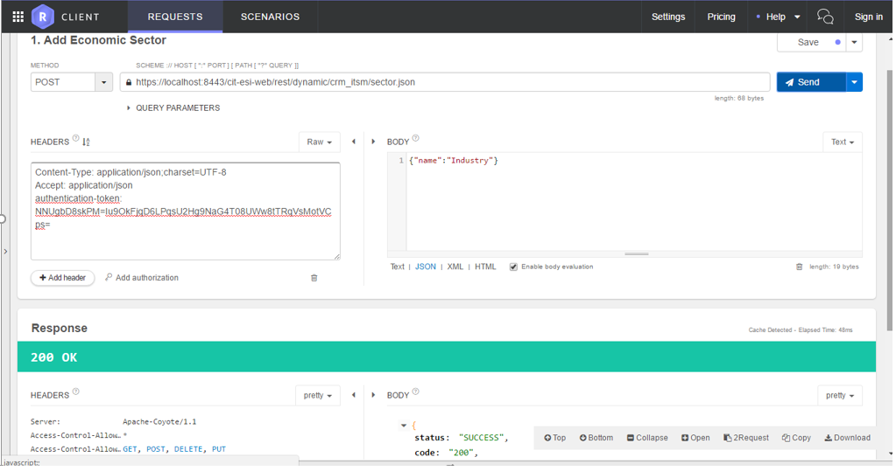
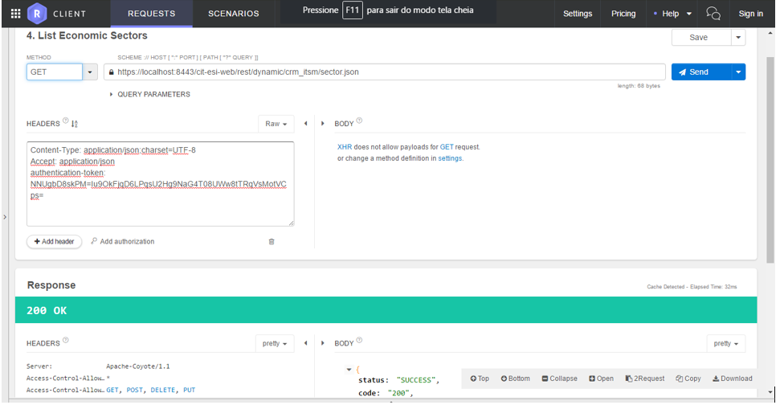
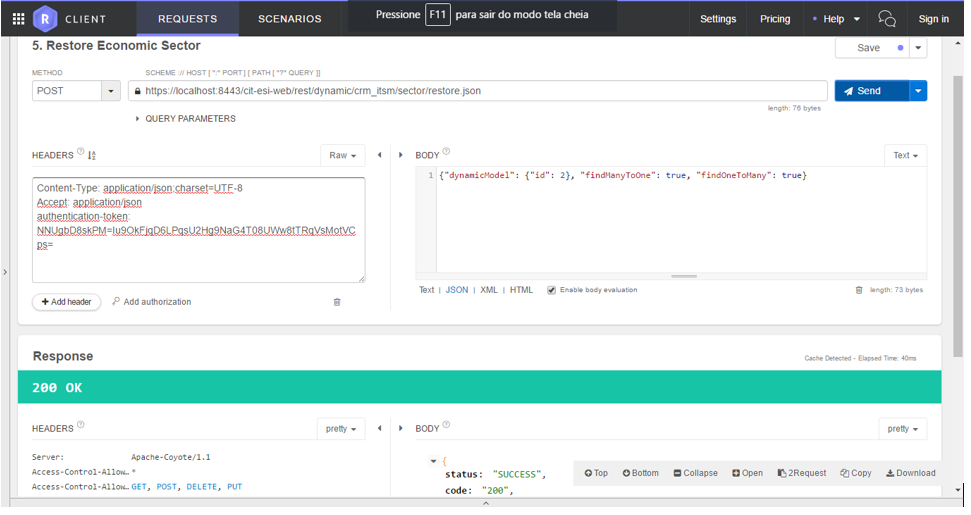
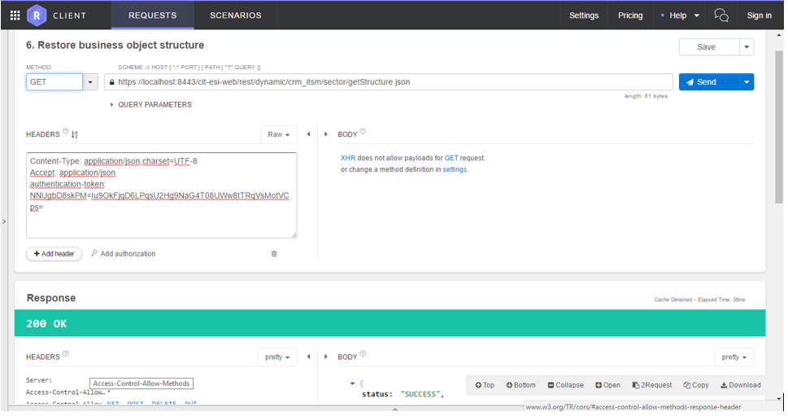
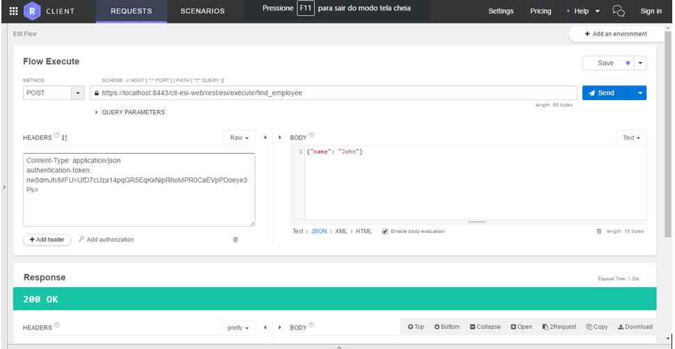

Title: Webservices - NEURO
Description: Webservices Neuro

#Webservices Neuro

Este documento reúne os conhecimentos mínimos necessários para o adequado uso dos serviços via Rest.

| **URL**                                      | **Descrição**                           | **Parâmetros**                                | **Retorna**                                        |
|----------------------------------------------|-------------------------------------------|-----------------------------------------------|---------------------------------------------------|
| **/startWithMap/{name}**                     | Inicia um fluxo ESI a partir do nome                | name: Nome do fluxo cadastrado             | Objeto representativo do fluxo cadastrado      |
| **/instance/initialize/{processInstanceId}** | Recupera os valores de uma instância de processo | processInstanceid: ID da instância de processo | Objeto representativo da instância de processo cadastrada |
| **/instance/suspend/{processInstanceId}**    | Suspende uma instância de processo               | processInstanceid: ID da instância de processo | Objeto representativo da instância de processo cadastrada |
| **/instance/restart/{processInstanceId}**    | Reinicia uma instância de processo               | processInstanceid: ID da instância de processo | Objeto representativo da instância de processo cadastrada |
| **/instance/reopen/{processInstanceId}**     | Reabre uma instância de processo                | processInstanceid: ID da instância de processo | Objeto representativo da instância de processo cadastrada |
| **/userTask/{userTaskId}**                   | Recupera uma tarefa de usuário                    | userTaskId: ID da tarefa de usuário criada       | Objeto representativo da instância de processo cadastrada |
| **/rule/executeWithMap/{name}**              | Executa uma regra de negócio                  | name: Nome da regra de negócio cadastrada    | Objeto representativo da regra de negócio executada      |

-   request body: JSON Objeto com variáveis para o fluxo
-   request body: JSON Objeto com variáveis para regras de negócio

**Tabela 1 - Especificação das APPLICATION PROGRAMMABLE INTERFACES (APIs)**

##ORIENTAÇÕES ESPECÍFICAS PARA ACESSO À API REST

Nas seções seguintes, está detalhado cada tipo de uso previsto para os serviços disponíveis via Rest no produto CITSmart Enteprise Neuro.

###Autenticação

Para usar as APIs, o cliente deve estar logado no Neuro. Para isso, basta obter um token a partir do serviço de autenticação e injetar esse token no header de cada requisição REST com o identificador authentication-token. A autenticação é feita através do serviço POST /cit-esi-web/rest/security/token, passando um objeto JSON com os atributos username e password no body.

**Figura 1 - Exemplo utilizando o plugin Restlet Client do Chrome**

###API REST de objetos de negócio

Cada objeto de negócio disponibiliza um conjunto de serviços REST que pode ser consumido a partir da URL /cit-esi-web/dynamic/{nome da aplicação}/{nome do objeto de negócio}. São serviços básicos de criação, atualização, listagem e exclusão do objeto de negócio, além de um método getStructure que retorna o metadado do objeto de negócio. Cada SQL criado no objeto de negócio também pode ser chamado na forma de método. Seguem exemplos utilizando o objeto de negócio hotel da aplicação hotéis. Para cada requisição, deve ser fornecido o authentication-token obtido no serviço de login. A url deve terminar com “.json”.

####Inclusão de objeto de negócio

-   **HTTP verb**: POST
-   **URL**: /cit-esi-web/rest/dynamic/{application name}/{business object name}.json
-   **Body**: JSON contendo os atributos do registro do objeto de negócio a ser incluído

**Figura 2 - Inclusão de objeto de negócio**

####Alteração de objeto de negócio

-   **HTTP verb**: POST
-   **URL**: /cit-esi-web/rest/dynamic/{application name}/{business object name} /update.json
-   **Body**: JSON contendo os atributosdo registro do objeto de negócio a ser alterado

**Figure 3 - Mudança de objeto de negócio**

####Exclusão de objeto de negócio

-   **HTTP verb**: POST
-   **URL**: /cit-esi-web/rest/dynamic/{application name}/{business object name}/remove.json
-   **Body**: JSON contendo a chave primária do registro do objeto de negócio a ser excluído

**Figura 4 - Exclusão de objeto de negócio**

####Listagem de objetos de negócio

-   **HTTP verb**: GET
-   **URL**: /cit-esi-web/rest/dynamic/{application name}/{business object name}.json

**Figura 5 - Listagem de objetos de negócio**

####Recuperação de objeto de negócio pela chave primária

-   **HTTP verb**: POST
-   **URL**: /cit-esi-web/rest/dynamic/{application name}/{business object name}/restore.json
-   **Body**: JSON contendo:
    -   A chave primária do registro do objeto de negócio a ser excluído
    -   Atributo boolean findManyToOne, indicando se o sistema deve recuperar os relacionamentos muitos para um do objeto
    -   Atributo boolean findOneToMany, indicando se o sistema deve recuperar os relacionamentos um para muitos do objeto

**Figura 6 - Recuperação de objeto de negócio pela chave primária**

####Recuperação da estrutura do objeto de negócio

-   **HTTP verb**: GET
-   **URL**: /cit-esi-web/rest/dynamic/{application name}/{business object name}/getStructure.json

**Figura 7 - Recuperação da estrutura do objeto de negócio**

####SQL Execução de objeto de negócio

-   **HTTP verb**: POST
-   **URL**: / cit-esi-web / rest / dynamic / {application name} / {business object name} /list.son
-   **Body**: JSON contendo:
    -   Atributo SQLName com o nome do SQL a ser executado
    -   Atributo JSON dynamicModel contendo os valores dos parâmetros esperados no SQL
    -   Atributo boolean findManyToOne (opcional), indicando se o sistema deve recuperar os relacionamentos muitos para um do objeto
    -   Atributo boolean findOneToMany (opcional), indicando se o sistema deve recuperar os relacionamentos um para muitos do objeto

**Figura 8 - Execução de SQL do objeto de negócio**

###Execução de fluxos ESI

Qualquer fluxo ESI pode ser executado via REST utilizando o serviço POST /cit-esi-web/rest/esi/execute/{nome do fluxo}. Para cada requisição, deve ser fornecido o authentication-token obtido no serviço de login. No corpo (body) da requisição deve ser fornecido um JSON contendo as variáveis de entrada necessárias à execução do fluxo. O exemplo abaixo executa o fluxo busca_empregado, fornecendo a matricula “12345” como variável de entrada do fluxo. O fluxo retorna o objeto JSON “empregado”.

**Figura 9 - Exemplo de execução de fluxos ESI**

<b>Produto/Versão:</b> CITSmart ESP | 8.00 &nbsp; &nbsp;
<b>Atualização:</b>07/01/2019 - João Pelles Junior
	

